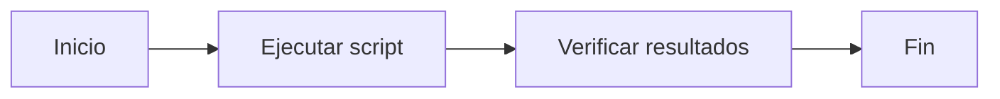

# 🚀 Mi Proyecto Profesional

## 📋 Descripción
Un proyecto que **automatiza tareas** usando scripts en Batch.

## 🛠️ Instalación
```bash
git clone https://github.com/usuario/proyecto.git
cd proyecto
install.bat
```

## 📝 Características
- [x] Automatización de updates
- [ ] Limpieza automática
- [ ] Reportes generados

## 🏆 Resultados
| Métrica | Antes | Después |
|---------|-------|---------|
| Tiempo | 2 horas | 15 min |
| Errores | 15% | 2% |

> [!TIP]
> **Consejo profesional:** Ejecuta como administrador

## 🔄 Flujo del Proceso


## 👨‍💻 Autor
**Juan Pérez** - [Mi Portfolio](https://mi-portfolio.com)

*¿Te gustó? ¡Dale una estrella! ⭐*
@echo off
echo Iniciando proceso de mantenimiento y actualización...

:: Comprobación de la imagen de Windows (DISM)
:: echo Verificando la imagen de Windows...
:: DISM /Online /Cleanup-Image /ScanHealth
:: DISM /Online /Cleanup-Image /RestoreHealth

:: Escaneo y reparación de archivos del sistema
echo Escaneando y reparando archivos del sistema...
sfc /scannow

:: Actualización de programas usando winget
echo Actualizando programas...
winget upgrade --all --include-unknown

:: Limpieza de disco
echo Realizando limpieza de disco...
cleanmgr /sagerun:1

:: Limpieza de archivos temporales
echo Limpiando archivos temporales...
del /s /q %temp%\*
del /s /q C:\Windows\Temp\*
rd /s /q %systemdrive%\$Recycle.bin

echo Mantenimiento completado.
echo Eliminando el script...
del "%~f0"
